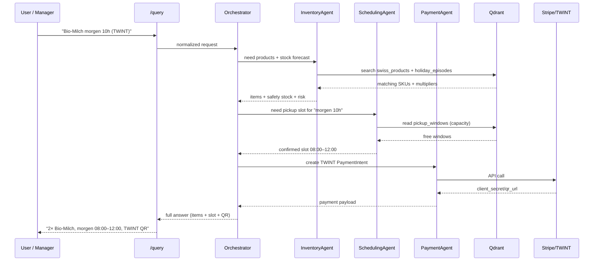
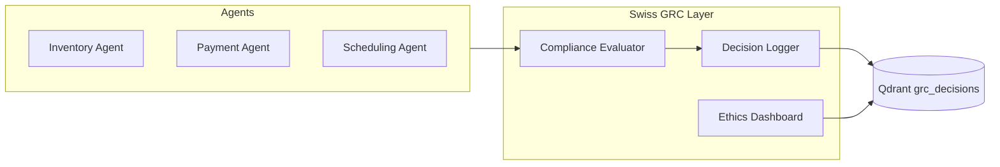
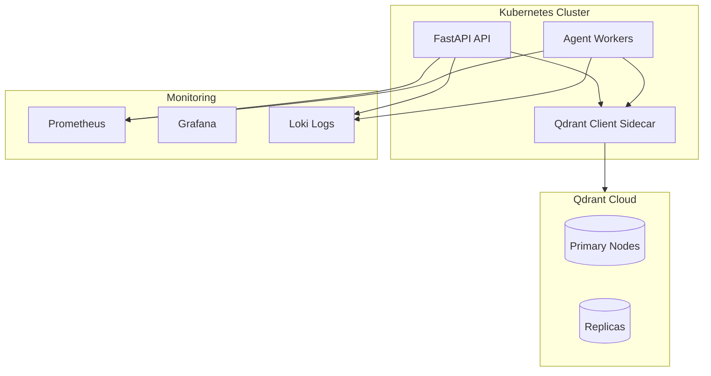

# Dynamic Vector – Qdrant AI Retail Store Supervisor 🇨🇭

> Multi‑agent, Qdrant‑powered AI supervisor for Swiss retail (Coop/Migros class) with holiday‑aware inventory, TWINT/Stripe checkout, punctual pickup scheduling, and production‑grade governance.

---

## 1. Vision & Problem Statement

Swiss retail (Coop, Migros, Denner, Landi, Jumbo) runs on thin margins, complex holidays, strict punctuality, and fragmented systems:

- Stockouts and overstock (Christmas dairy, fondue season, ski season).
- Fragmented checkout (TWINT, PostFinance, Stripe, cash).
- Manual pickup scheduling (“morgen 10h Zürich HB”) in Excel.
- No unified AI supervisor coordinating decisions across inventory, pricing, checkout, and scheduling.

**Dynamic Vector** is a **multi‑agent AI retail supervisor** built on **Qdrant** that:

- Predicts **holiday & seasonal demand** and prevents stockouts.
- Orchestrates **TWINT / Stripe / PostFinance** payments.
- Interprets **Swiss natural language time (“morgen 10h”)** and enforces punctual pickup windows.
- Enforces **Swiss AI governance** (FADP, EU AI Act‑aligned, Swiss GRC).

---

## 2. High‑Level Architecture

```mermaid
flowchart LR
    subgraph Client
      Web[Web Dashboard] 
      Mobile[Mobile PWA (Pickup, Cashier)]
    end

    subgraph API[FastAPI Backend]
      Router[REST / WebSocket API]
      Agents[Multi‑Agent Orchestrator]
      InvAgent[Inventory Agent]
      PayAgent[Checkout Agent]
      SchedAgent[Scheduling Agent]
      DemandAgent[Demand Forecaster]
      GRC[Swiss GRC / Audit Layer]
    end

    subgraph QdrantCloud[Qdrant Vector DB]
      ProdCol[swiss_products]
      OrdersCol[orders]
      PickCol[pickup_windows]
      HolidayCol[holiday_episodes]
      PayCol[payment_episodes]
      GrcCol[grc_decisions]
    end

    subgraph Ext[External Systems]
      TWINT[TWINT API]
      Stripe[Stripe]
      PostFinance[PostFinance PSP]
      ERP[ERP / Legacy POS]
    end

    Client <--> Router
    Router --> Agents
    Agents --> InvAgent
    Agents --> PayAgent
    Agents --> SchedAgent
    Agents --> DemandAgent
    Agents --> GRC

    InvAgent <--> ProdCol
    DemandAgent <--> HolidayCol
    PayAgent <--> PayCol
    SchedAgent <--> PickCol
    GRC <--> GrcCol

    PayAgent <--> TWINT
    PayAgent <--> Stripe
    PayAgent <--> PostFinance
    InvAgent <--> ERP
```

**Key idea:** All agents share **one source of truth** – Qdrant collections – and coordinate through a lightweight orchestrator.

---

## 3. Core Use Cases

1. **Holiday‑aware inventory & demand**
   - “Bio‑Milch für Weihnachten” → detect 4x Christmas demand multiplier → increase safety stock and reorder.

2. **TWINT‑first checkout**
   - Web/API → create TWINT QR → webhook updates payment + inventory via Qdrant.

3. **Swiss date/time + punctuality**
   - “morgen 10h Zürich HB” → next business day, morning window 08:00–12:00, capacity‑aware pickup scheduling.

4. **AI supervisor for store managers**
   - Store managers get a **single dashboard** with alerts, forecasts, and suggestions instead of juggling ERP + Excel + email.

5. **Governance & compliance**
   - Every AI decision is logged, explainable, and scored by a **Swiss GRC** layer (bias, privacy, human‑in‑loop).

---

## 4. Collections & Data Model (Qdrant)

```mermaid
erDiagram
    SWISS_PRODUCTS {
      string sku
      string name_de
      string name_fr
      string name_it
      string category
      float  price_chf
      int    stock
      float  holiday_multiplier
      string tenant
    }

    HOLIDAY_EPISODES {
      string id
      date   date
      string name
      string category
      float  multiplier
    }

    PICKUP_WINDOWS {
      string id
      datetime window_start
      datetime window_end
      string store_id
      int capacity
      int booked
    }

    PAYMENT_EPISODES {
      string id
      string provider   // twint, stripe, postfinance
      string status
      float  amount_chf
      string order_id
      string tenant
    }

    GRC_DECISIONS {
      string decision_id
      string agent
      string compliance_status
      float  bias_drift_pct
      float  privacy_risk_pct
      bool   human_override
      datetime decision_time
    }
```

### `swiss_products` (semantic product search + filters)

- Vector: 384‑dim embedding of multilingual name/description.
- Payload:
  - `sku`, `tenant` (`coop`, `migros`, …)
  - `category` (dairy, chocolate, fondue, ski_gear)
  - `stock`, `price_chf`
  - `holiday_multiplier` (dynamic field from demand agent).

### `holiday_episodes`

Historical and future episodes like “Christmas dairy 4x”, “Easter chocolate 2.5x”, “Fondue season 1.5x cheese”.

### `pickup_windows`

Time windows (08:00–12:00, 14:00–18:00) with capacity per store; used by the scheduling agent.

### `payment_episodes`

Aggregated TWINT/Stripe/PostFinance payment metadata for analytics and debugging.

### `grc_decisions`

Immutable log of AI decisions and compliance evaluation (for Swiss GRC, regulators, internal audit).

---

## 5. Multi‑Agent Orchestrator



The orchestrator is implemented as a **tool‑calling agent** or an explicit Python orchestrator:

- Route based on intent (`inventory`, `checkout`, `schedule`).
- Enforce **business invariants** (e.g. only confirm if stock ≥ required for the selected window).

---

## 6. Inventory & Demand Agent

### 6.1 Holiday‑aware demand calculation

```python
# services/holiday_inventory.py
from datetime import date, timedelta
from typing import Dict, List

class HolidayInventoryService:
    def __init__(self, qdrant_client):
        self.qdrant = qdrant_client

    async def get_demand_multiplier(
        self,
        target_date: date,
        category: str,
        tenant: str,
    ) -> float:
        """
        Look up historical + planned holiday episodes to compute demand multiplier.
        """
        # Example predicate: episodes +/- 7 days
        # (implementation uses Qdrant filter + optional vector query)
        episodes = await self.qdrant.scroll(
            collection_name="holiday_episodes",
            scroll_filter={
                "must": [
                    {"key": "tenant", "match": {"value": tenant}},
                    {"key": "category", "match": {"value": category}},
                ]
            }
        )

        base = 1.0
        for ep in episodes:
            multiplier = ep.payload.get("multiplier", 1.0)
            base *= multiplier

        # Add seasonality (fondue, ski season, etc.)
        if 11 <= target_date.month <= 2 and category in {"cheese", "fondue"}:
            base *= 1.5
        if 12 <= target_date.month <= 3 and category in {"ski_gear", "goggles"}:
            base *= 2.0

        return round(base, 2)

    async def compute_safety_stock(
        self,
        sku: str,
        base_stock: int,
        category: str,
        tenant: str,
        today: date | None = None,
    ) -> int:
        today = today or date.today()
        multiplier = await self.get_demand_multiplier(today, category, tenant)
        # At least 2× baseline, scaled by multiplier
        return max(int(base_stock * multiplier), base_stock * 2)
```

### 6.2 Updating Qdrant payloads

```python
async def annotate_products_with_demand(qdrant, tenant: str):
    points, _ = await qdrant.scroll(
        collection_name="swiss_products",
        scroll_filter={"must": [{"key": "tenant", "match": {"value": tenant}}]},
    )

    service = HolidayInventoryService(qdrant)
    upserts = []
    for p in points:
        cat = p.payload["category"]
        stock = p.payload["stock"]
        multiplier = await service.get_demand_multiplier(date.today(), cat, tenant)
        safety = await service.compute_safety_stock(
            p.payload["sku"], stock, cat, tenant
        )
        upserts.append(
            {
                "id": p.id,
                "payload": {
                    "holiday_multiplier": multiplier,
                    "safety_stock": safety,
                },
            }
        )

    await qdrant.set_payload(collection_name="swiss_products", points=upserts)
```

---

## 7. Checkout & Payments Agent (TWINT + Stripe)

### 7.1 Stripe backend example (PaymentIntent‑based)

```python
# services/stripe_gateway.py
import stripe
from pydantic import BaseModel
from decimal import Decimal

class StripeConfig(BaseModel):
    secret_key: str
    currency: str = "chf"
    statement_descriptor: str = "Dynamic Vector CH"

class StripeGateway:
    def __init__(self, cfg: StripeConfig):
        stripe.api_key = cfg.secret_key
        self.cfg = cfg

    def create_payment_intent(
        self,
        order_id: str,
        amount_chf: Decimal,
        customer_email: str | None,
        tenant: str,
    ) -> stripe.PaymentIntent:
        return stripe.PaymentIntent.create(
            amount=int(amount_chf * 100),
            currency=self.cfg.currency,
            metadata={"order_id": order_id, "tenant": tenant},
            receipt_email=customer_email,
            automatic_payment_methods={"enabled": True},
            statement_descriptor=self.cfg.statement_descriptor,
        )
```

### 7.2 TWINT (pattern)

The pattern is:

- API call to TWINT for a payment session.
- Return QR string / URL to frontend.
- Webhook updates `payment_episodes` and `orders` in Qdrant.

```python
# services/twint_gateway.py (pseudo)
class TwintGateway:
    async def create_payment(self, order_id: str, amount_chf: Decimal, phone_hash: str):
        # Call TWINT API, create payment, return qr_string
        ...

    async def handle_webhook(self, payload: dict):
        # Verify signature, then mark payment episode as paid in Qdrant
        ...
```

---

## 8. Swiss Date/Time & Scheduling Agent

### 8.1 Parsing Swiss natural language time

```python
# services/swiss_datetime.py
import re
from datetime import datetime, date, time, timedelta

SWISS_TIME_PATTERNS = [
    r"(?P<day>heute|morgen)\s+(?P<hour>\d{1,2})h(?P<minute>\d{0,2})?",
    r"(?P<hour>\d{1,2}):(?P<minute>\d{2})",
]

def parse_swiss_datetime(text: str, ref: datetime | None = None) -> datetime:
    ref = ref or datetime.now()
    t = text.lower()

    day_offset = 0
    if "morgen" in t:
        # Next business day (Mon–Fri)
        day_offset = 1
        if ref.weekday() >= 4:
            # Friday → Monday
            day_offset = 7 - ref.weekday()

    hour, minute = 9, 0  # sensible default
    for pattern in SWISS_TIME_PATTERNS:
        m = re.search(pattern, t)
        if m:
            if "hour" in m.groupdict():
                hour = int(m.group("hour"))
            if "minute" in m.groupdict() and m.group("minute"):
                minute = int(m.group("minute"))
            break

    dt = ref.replace(hour=hour, minute=minute, second=0, microsecond=0)
    dt += timedelta(days=day_offset)
    return dt
```

### 8.2 Snapping to pickup windows & capacity

```python
# services/pickup_scheduler.py
from dataclasses import dataclass

@dataclass
class PickupWindow:
    id: str
    start: datetime
    end: datetime
    capacity: int
    booked: int

class PickupScheduler:
    def __init__(self, qdrant_client):
        self.qdrant = qdrant_client

    @staticmethod
    def business_windows_for_day(day: date):
        return [
            (datetime.combine(day, time(8, 0)), datetime.combine(day, time(12, 0))),
            (datetime.combine(day, time(14, 0)), datetime.combine(day, time(18, 0))),
        ]

    async def find_best_window(self, store_id: str, requested: datetime) -> PickupWindow | None:
        windows = await self.qdrant.scroll(
            collection_name="pickup_windows",
            scroll_filter={
                "must": [
                    {"key": "store_id", "match": {"value": store_id}},
                    {
                        "key": "window_start",
                        "range": {
                            "gte": requested.replace(hour=0, minute=0).isoformat(),
                            "lte": requested.replace(hour=23, minute=59).isoformat(),
                        },
                    },
                ]
            },
        )
        candidates: list[PickupWindow] = []
        for p in windows:
            candidates.append(
                PickupWindow(
                    id=p.id,
                    start=datetime.fromisoformat(p.payload["window_start"]),
                    end=datetime.fromisoformat(p.payload["window_end"]),
                    capacity=p.payload["capacity"],
                    booked=p.payload["booked"],
                )
            )

        # choose earliest window with remaining capacity, and closest start time
        candidates = [c for c in candidates if c.booked < c.capacity]
        if not candidates:
            return None
        return sorted(
            candidates,
            key=lambda c: (c.start, abs((c.start - requested).total_seconds())),
        )
```

---

## 9. Governance & Swiss GRC Integration



### 9.1 Decision logging and compliance scoring

```python
# grc/swiss_grc.py
from enum import Enum
from pydantic import BaseModel

class ComplianceStatus(str, Enum):
    GREEN = "compliant"
    YELLOW = "monitor"
    RED = "non-compliant"

class DecisionContext(BaseModel):
    agent: str
    tenant: str
    payload: dict
    bias_drift_pct: float
    privacy_risk_pct: float
    explainability_score: float
    human_override: bool

class SwissGRC:
    def __init__(self, qdrant_client):
        self.qdrant = qdrant_client
        self.bias_threshold = 0.5
        self.privacy_threshold = 2.0
        self.explainability_threshold = 0.85

    def evaluate(self, ctx: DecisionContext) -> ComplianceStatus:
        if ctx.privacy_risk_pct > self.privacy_threshold or ctx.bias_drift_pct > self.bias_threshold:
            return ComplianceStatus.RED
        if ctx.explainability_score < self.explainability_threshold:
            return ComplianceStatus.YELLOW
        return ComplianceStatus.GREEN

    async def log(self, decision_id: str, ctx: DecisionContext, status: ComplianceStatus):
        await self.qdrant.upsert(
            collection_name="grc_decisions",
            points=[
                {
                    "id": decision_id,
                    "vector": ctx.payload.get("embedding") or [0.0] * 384,
                    "payload": {
                        "agent": ctx.agent,
                        "tenant": ctx.tenant,
                        "compliance_status": status.value,
                        "bias_drift_pct": ctx.bias_drift_pct,
                        "privacy_risk_pct": ctx.privacy_risk_pct,
                        "explainability_score": ctx.explainability_score,
                        "human_override": ctx.human_override,
                        "decision_time": datetime.utcnow().isoformat(),
                    },
                }
            ],
        )
```

---

## 10. API Surface (FastAPI)

### 10.1 Key endpoints

- `POST /query` – natural language multi‑agent query (“Bio-Milch morgen 10h TWINT”).
- `GET /products/search` – semantic product search.
- `GET /holidays/forecast` – demand multiplier forecast by category/date.
- `POST /checkout/stripe` – create Stripe PaymentIntent.
- `POST /checkout/twint` – create TWINT QR.
- `POST /time/parse` – Swiss datetime parsing.
- `GET /schedule/windows` – next pickup windows with capacity.
- `GET /metrics/impact` – ROI, CO₂, and human impact metrics.
- `GET /grc/compliance-score` – governance metrics.

Example orchestrated endpoint:

```python
# app/routers/query.py
from fastapi import APIRouter
from pydantic import BaseModel

router = APIRouter(prefix="/query", tags=["orchestrator"])

class RetailQuery(BaseModel):
    text: str
    tenant: str = "coop"
    store_id: str

@router.post("")
async def handle_query(q: RetailQuery):
    """
    High-level natural language entry point.
    Example: "2x Bio-Milch morgen 10h TWINT"
    """
    # 1. NLU → intent + entities (product, quantity, time, payment)
    # 2. Call inventory, scheduling, payment agents
    # 3. Aggregate response for the client
    ...
```

---

## 11. Deployment Topology



- **Qdrant Cloud** for managed vectors and RBAC.  
- **FastAPI** + Uvicorn behind an ingress (NGINX/ALB).
- **Workers** for long‑running tasks (Python RQ/Celery, or background tasks).

---

## 12. Local Development

### 12.1 Prerequisites

- Python 3.11+
- Docker / Docker Compose
- Node.js (if you add a SPA frontend)
- Stripe and TWINT sandbox keys (optional but recommended)

### 12.2 Running Qdrant + API

```bash
# Start Qdrant locally
docker run -p 6333:6333 -p 6334:6334 qdrant/qdrant:latest

# Install backend
pip install -r requirements.txt

# Start FastAPI
uvicorn app.main:app --reload --port 8000
```

### 12.3 Smoke tests

```bash
# Health check
curl http://localhost:8000/health

# Semantic product search
curl "http://localhost:8000/products/search?q=Bio-Milch&tenant=coop"

# Holiday forecast
curl "http://localhost:8000/holidays/forecast?category=dairy&days=7"

# Swiss time parse
curl -X POST "http://localhost:8000/time/parse" -d "query=morgen 10h Zürich HB"
```

---

## 13. Extending the System

### Add a new agent (e.g., Sustainability Agent)

1. Create a new service module (`services/sustainability_agent.py`).
2. Define how it reads from/writes to Qdrant (`sustainability_episodes` collection).
3. Expose tools to the orchestrator (sustainability scoring, CO₂ savings estimation).
4. Wire into `/metrics/impact` and dashboards.

### Swap LLM provider

The orchestrator can be LLM‑agnostic:

- OpenAI, Anthropic, Groq, local LLMs.
- Only requirement: supports tool calling and structured outputs.

---

## 14. Roadmap

- [ ] Add React dashboard (multi‑tenant, per‑store).
- [ ] Implement full TWINT gateway and webhook handlers.
- [ ] Integrate Swiss GRC SaaS API for external audits.
- [ ] Add training scripts for store‑specific fine‑tuning.
- [ ] Helm charts for production deployment.

---

## 15. License & Contributions

- **License**: MIT (or your choice).
- **Contributions**:
  - New agents (e.g., marketing, sustainability).
  - Frontend dashboards.
  - New region packs (DE/FR/IT beyond Switzerland).

> If you’re running Qdrant in production retail or want to adapt Dynamic Vector to another market, open an issue or PR – this repo is designed as a **reference architecture** for agentic retail AI with Qdrant.

