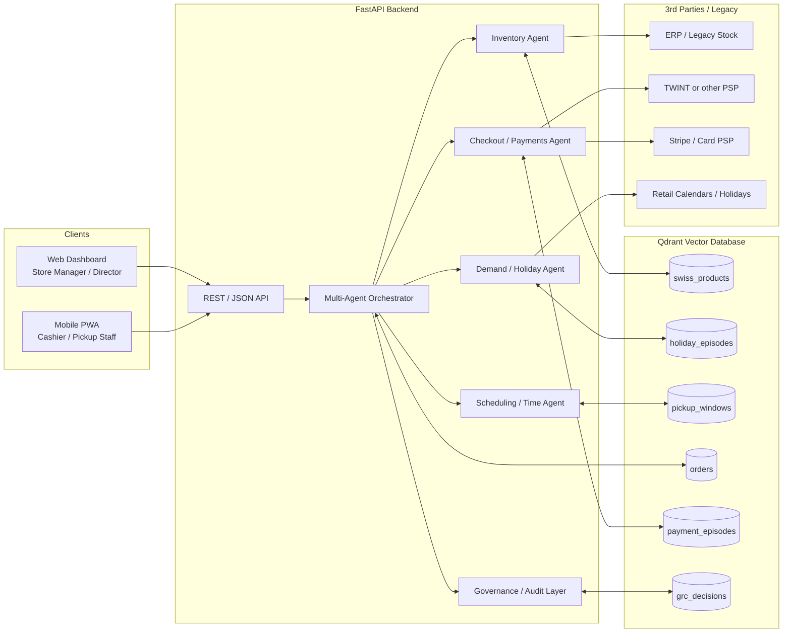
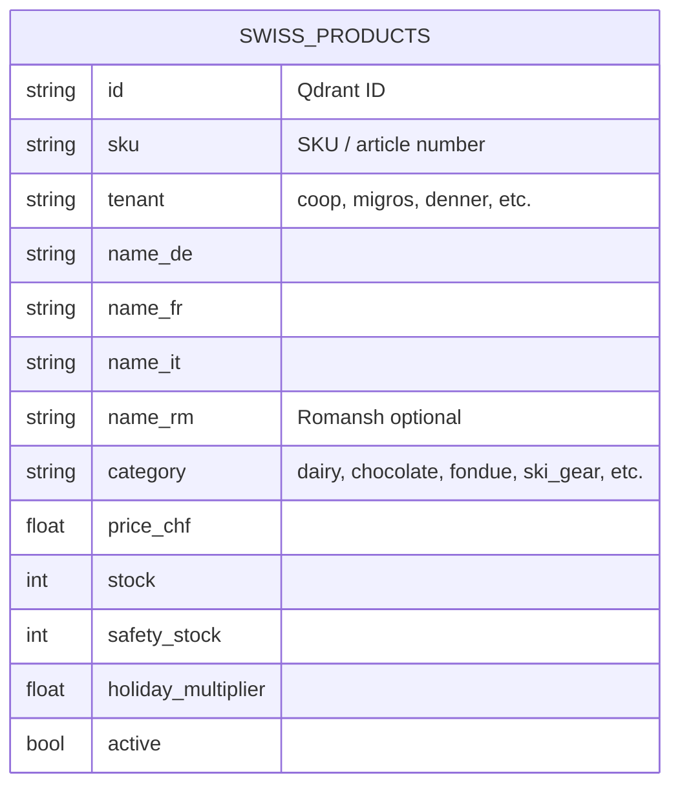
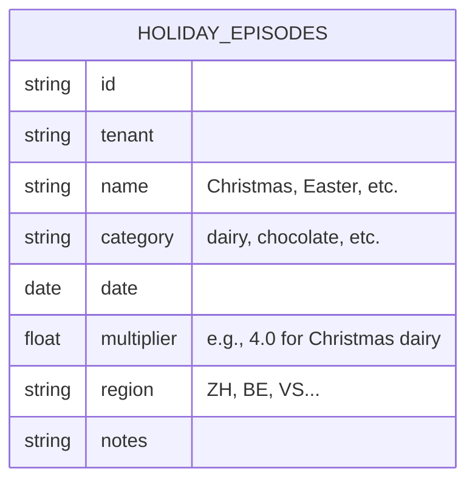
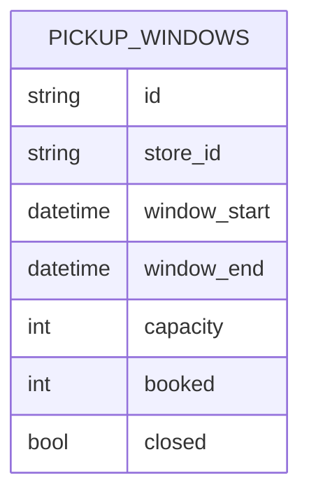
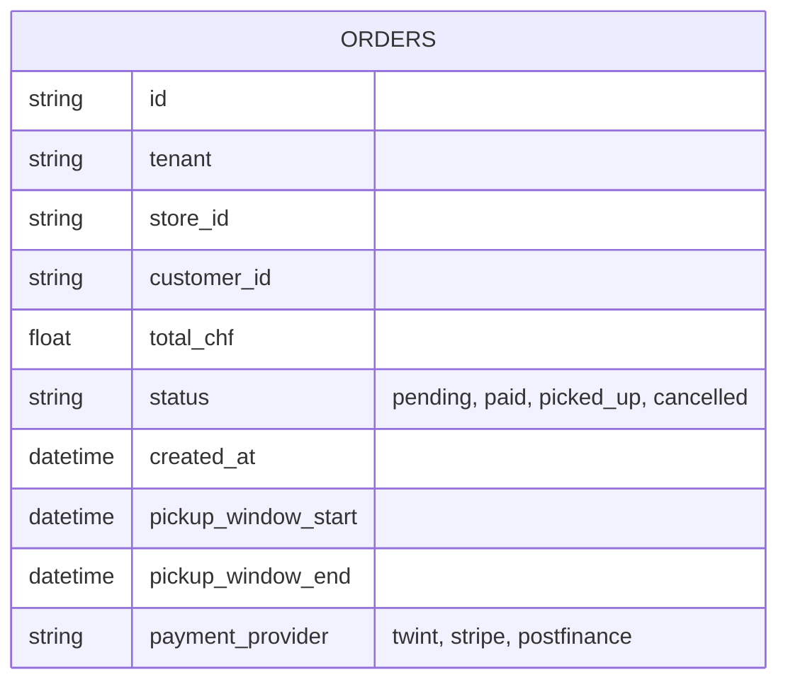
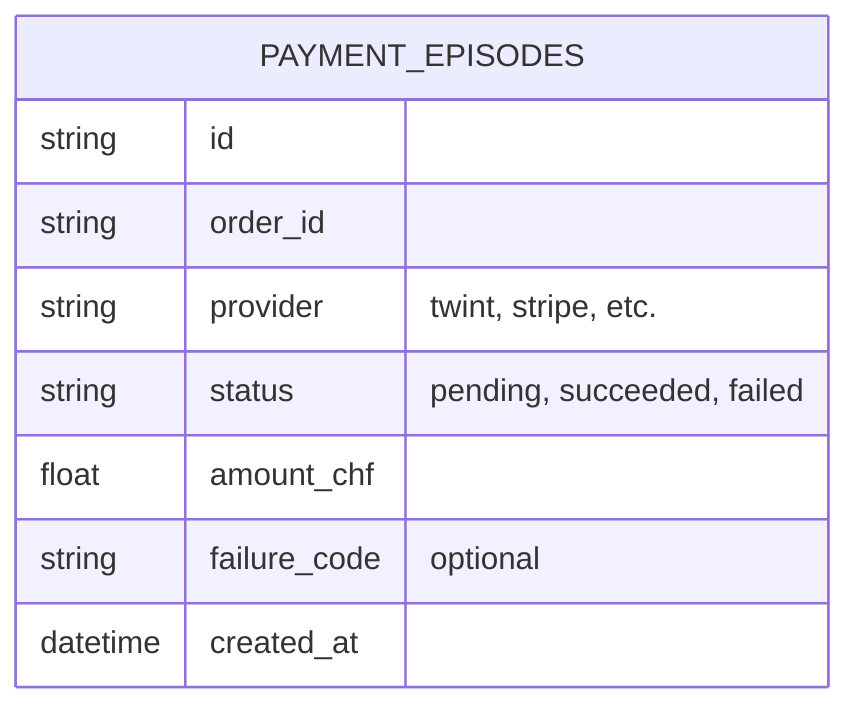
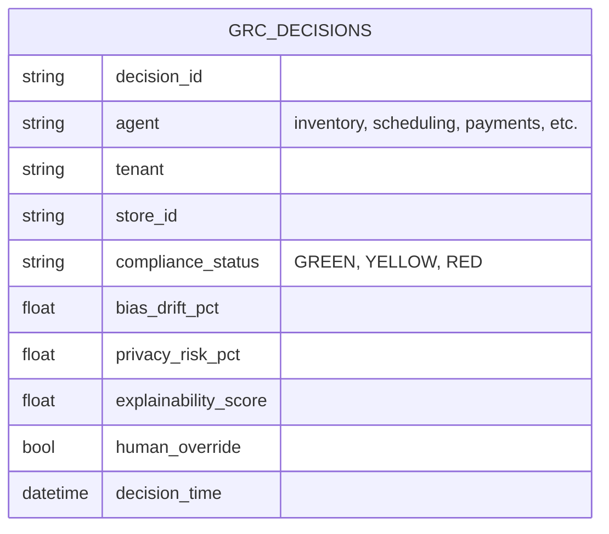
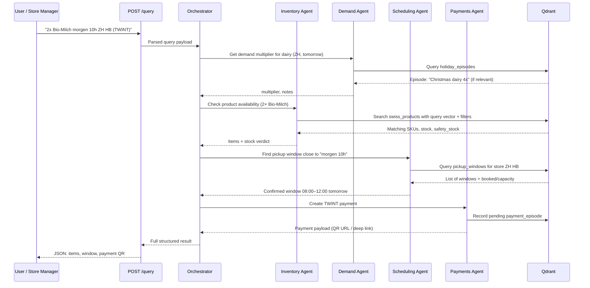
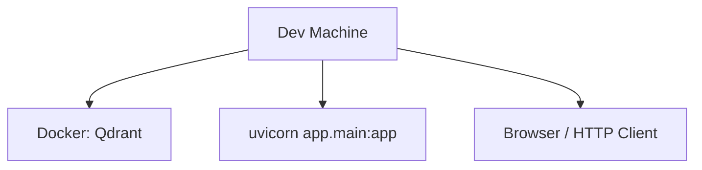
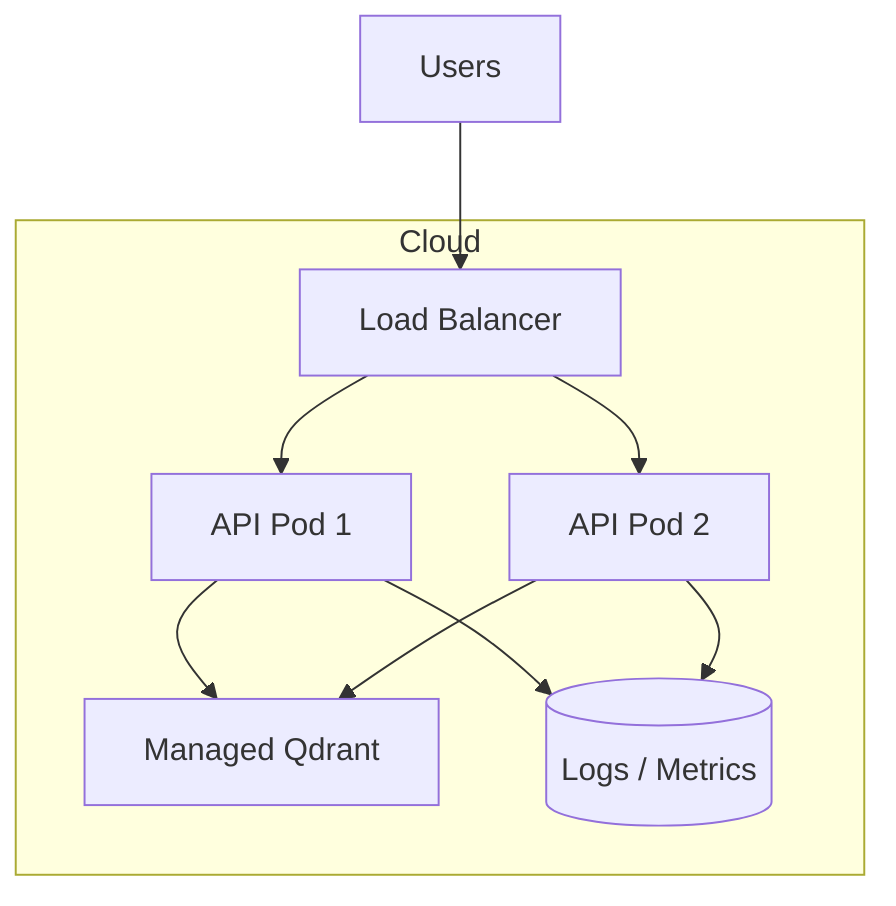

# Dynamic Vector

Dynamic Vector is a **hackathon-scale monorepo** for a multi-agent shopping / retail assistant built around **Qdrant** (vector search + “shared memory”). Built for the GenAI Zurich Hackathon 2026.

This repository intentionally contains **multiple runnable tracks** (from “no API keys” to “full multi-agent backend”) plus several research/demo pipelines. The previous root README also had two different drafts merged together; this version keeps the length, but makes the story consistent.

## TL;DR (what should I run?)

| Goal | What to run | Needs API keys? | What you get |
|---|---|---:|---|
| Try the UI quickly | `docker compose up --build` (repo root) | No | `server/` (JWT demo auth) + `web/` (React UI) |
| Run the multi-agent backend API | `uvicorn app.main:app ...` inside `backend/` | Sometimes (depends on features) | Full FastAPI app with hybrid retrieval + multilingual/voice/geospatial/checkout demos |
| Run Streamlit “judge demos” | `streamlit run ...` inside `backend/` | Usually no (local Qdrant) | Live orchestration dashboards + dataset demos |
| Run the mobile/desktop client | `./gradlew :composeApp:run` | No (auth only) | KMP app (Android/iOS/Desktop) hitting the same auth endpoint |

If you only have 5 minutes: run **root Docker Compose**, log in with the demo account, and explore the UI. If you want the multi-agent/Qdrant work, jump to **“Running the full backend (`backend/`)”** below.

## Architecture

```
┌─────────────────────┐     ┌──────────────────────┐
│  KMP Mobile App     │     │  React Web Frontend  │
│  (Android/iOS/JVM)  │     │  (Vite + shadcn/ui)  │
└────────┬────────────┘     └──────────┬───────────┘
         │                             │
         │    POST /token (JWT auth)   │
         └──────────┬──────────────────┘
                    ▼
         ┌─────────────────────┐
         │  server/             │  ← Lightweight auth server (no API keys needed)
         │  FastAPI + JWT       │
         └─────────────────────┘
                    │
                    ▼ (optional)
         ┌─────────────────────┐
         │  backend/            │  ← Full multi-agent system (Qdrant + hybrid RAG demos)
         │  FastAPI + agents    │
         └──┬──────────┬──────┘
            ▼          ▼
      ┌─────────┐ ┌─────────┐
      │ Qdrant  │ │  Redis  │
      └─────────┘ └─────────┘
```

## Monorepo Structure

```
├── composeApp/              # KMP app (Android, iOS, Desktop)
├── iosApp/                  # iOS Xcode project
├── server/                  # Lightweight FastAPI server (auth, health)
│   └── app/
│       ├── main.py          #   FastAPI entrypoint
│       └── auth.py          #   JWT auth (hardcoded demo accounts)
├── backend/                 # Full multi-agent system (requires API keys)
│   ├── app/                 #   FastAPI application + agents
│   │   ├── agents/          #   Shopper, Inventory, Pricing, Merchandising, Audit
│   │   └── routers/         #   Multilingual, voice, geospatial, checkout
│   ├── scripts/             #   Data ingestion, seeding
│   └── data/                #   Datasets
├── web/                     # React/TypeScript frontend
│   └── src/                 #   Pages, components, hooks
├── frontend/                # Older/alternate web app scaffold (AI Studio export)
├── docker-compose.yml       # Run server + web with one command
└── .env.example             # Environment variables template (for backend/)
```

## Quick Start

### Option 1: Docker (recommended)

```shell
docker compose up --build
```

This starts:
- **Server** (auth + health) on http://localhost:8000
- **React web frontend** on http://localhost:8080

No API keys needed — the server module is self-contained.

### Option 2: Run services individually

**1. Start the server:**
```shell
cd server
pip install -r requirements.txt
uvicorn app.main:app --port 8000 --reload
```

**2. Start the web frontend:**
```shell
cd web
npm install
npm run dev
```

**3. Run the KMP mobile app** (see below).

### Running the full backend (optional)

The `backend/` module contains the full multi-agent system: hybrid retrieval on Qdrant, multi-agent orchestration patterns, and several “judge demo” apps (FastAPI + Streamlit). Some features can run with **local Qdrant only**; some require API keys (voice, certain hosted models).

```shell
cp .env.example .env
# Edit .env with your API keys
cd backend
pip install -r requirements.txt
uvicorn app.main:app --port 8000 --reload
```

For all `backend/` demos (datasets, Streamlit dashboards, performance stacks, Neo4j knowledge-graph stacks, etc.), see `backend/README.md` and `backend/Makefile`.

## KMP Mobile App

The KMP app targets Android, iOS, and Desktop (JVM). Code structure:

- [commonMain](./composeApp/src/commonMain/kotlin) — Shared UI and logic across all platforms
- [androidMain](./composeApp/src/androidMain/kotlin) — Android-specific code
- [iosMain](./composeApp/src/iosMain/kotlin) — iOS-specific code
- [jvmMain](./composeApp/src/jvmMain/kotlin) — Desktop-specific code

### Build and Run Desktop (JVM)

```shell
./gradlew :composeApp:run
```

### Build and Run Android

```shell
./gradlew :composeApp:assembleDebug
```

Or use the run configuration in Android Studio / IntelliJ.

### Build and Run iOS

Open [/iosApp](./iosApp) in Xcode and run from there.

## Authentication

Auth uses hardcoded demo accounts with JWT tokens. All clients (KMP and React) authenticate against the same `POST /token` endpoint on the server. There is no registration route — this is intentional to block random visitors.

| Username | Password   | Intended Use               |
|----------|------------|----------------------------|
| `demo`   | `demo123`  | General testing            |
| `alice`  | `alice123` | Second persona             |
| `bob`    | `bob123`   | Third persona              |
| `judge`  | `judge123` | Hackathon judges           |

Accounts can be added/removed in `server/app/auth.py`.

## Server Endpoints

| Endpoint | Method | Purpose |
|----------|--------|---------|
| `/token` | POST | Login (OAuth2 password flow) |
| `/users/me` | GET | Current user info (requires JWT) |
| `/health` | GET | Health check |

## Backend Endpoints (full system)

| Endpoint | Method | Purpose |
|----------|--------|---------|
| `/query?q=...` | GET | Single-shot RAG answer |
| `/stream_query?q=...` | GET (SSE) | Streaming RAG answer |
| `/chat/swiss` | POST | Multilingual chat (DE/FR/IT/EN) |
| `/ws/voice/{tenant}` | WS | Bidirectional voice chat |
| `/products` | GET | Product catalog search |
| `/api/visual-search` | POST | CLIP image search |
| `/api/stores/nearby` | GET | Geospatial store locator |
| `/checkout/twint` | POST | TWINT payment |

## Backend Agents

- **ShopperAgent** — Extracts intent, budget, region, urgency from free-text queries
- **InventoryAgent** — Hybrid vector search on Qdrant, bundle optimization
- **PricingAgent** — Competitive pricing heuristics
- **MerchandisingAgent** — Promo text and layout generation
- **AuditAgent** — Hallucination detection + safety guardrails
- **Supervisor** — Orchestrates all agents in parallel phases

## Environment Variables

The `server/` module requires no environment variables.

The `backend/` module requires API keys. Copy `.env.example` to `.env` and fill in:

- `QDRANT_URL` / `QDRANT_API_KEY` — Qdrant Cloud connection
- `HF_TOKEN` — HuggingFace embeddings
- `OPENAI_API_KEY` — Whisper voice transcription
- `GROQ_API_KEY` — Agent reasoning (Mixtral)
- `REPLICATE_API_TOKEN` — Video keyframe embeddings
- `ELEVENLABS_API_KEY` — German TTS

## Tech Stack

- **Mobile:** Kotlin Multiplatform + Compose Multiplatform (Android, iOS, JVM Desktop)
- **Web:** React, TypeScript, Vite, shadcn/ui, TailwindCSS
- **Server:** Python, FastAPI, JWT auth
- **Backend:** Python, FastAPI, multi-agent orchestration
- **Vector DB:** Qdrant (hybrid text + image search)
- **Session Cache:** Redis (1hr TTL, max 10 turns)
- **HTTP Client (KMP):** Ktor Client
- **Auth:** JWT bearer tokens, hardcoded demo accounts


---

## Appendix A — Long-form “Swiss Retail Supervisor” spec (kept on purpose)

The section below is the original long-form narrative/spec that came with this project.

- **Why it’s here**: it doubles as a hackathon “judging doc” and a contributor-facing design reference.
- **How to read it**: treat it as a *reference architecture*. Parts map directly to the existing `backend/app/routers/*` and agent patterns; other parts are *roadmap / placeholders* (e.g., real TWINT/Stripe integrations).
- **If you want runnable instructions**: use the sections above, plus `backend/README.md` + `backend/Makefile`.

With that framing, here is the long-form spec (kept intentionally long).

## 1. Overview

Modern Swiss retail faces:

- **Stockouts & overstock** around holidays (Christmas dairy, Easter chocolate, fondue season, ski season).
- Fragmented **checkout**: TWINT, PostFinance, Stripe/Card, etc.
- Excel‑driven **pickup scheduling** (“morgen 10h Zürich HB”) with no capacity model.
- No single **AI supervisor** coordinating inventory, pricing, scheduling, and payments.

**Dynamic Vector** is a reference architecture that shows how to build a:

- **Qdrant‑centric AI backbone** (all agents read/write vectors and payloads).
- **Multi‑agent supervisor** (inventory, checkout, scheduling, forecasting).
- **Swiss‑aware UX** (time formats, payment methods, holidays).
- **Governed, auditable AI** (Swiss‑style governance, explainability, risk monitoring).

### Key Capabilities

- 🔍 Multilingual semantic search over `swiss_products` (DE / FR / IT / RM).
- 📦 Holiday‑ and season‑aware **demand forecasting** + safety stock.
- ⏰ Swiss date/time parsing: “morgen 10h” → next business day morning window.
- 💳 TWINT/Stripe‑style checkout flow (patterned, safe to plug real APIs into).
- 🧠 Multi‑agent orchestration with Qdrant as a **shared memory**.
- 🛡 Governance & audit: all key AI decisions logged and scored.

---

## 2. High‑Level Architecture

At a high level:

- **Clients** (web dashboard, mobile PWA) talk to a **FastAPI backend**.
- The backend exposes **REST endpoints** and routes complex flows through a **Multi‑Agent Orchestrator**.
- Agents use a shared **Qdrant client** and several **Qdrant collections** to store products, episodes, windows, and governance logs.

### 2.1 System Diagram



---

## 3. Core Concepts

### 3.1 Qdrant as Shared Memory

All agents share:

- A **vector space** for semantic similarity (product names, user queries, episodes).
- **Payloads** with structured retail data (stock, price, pickup capacity, tenant, region, etc.).

Benefits:

- Agents don’t directly depend on each other’s internal state.
- New agents can be added by reading/writing vectors and payloads into collections.
- Qdrant’s filters & payload indexes allow **fast, complex queries** (e.g., “dairy in ZH with stock < safety_stock and holiday_multiplier > 2”).

### 3.2 Episodic Memory

Instead of only static data, we also encode **episodes**:

- “Christmas 2025 dairy demand was 4x, low stock by 16:00.”
- “Pickup window 08:00–12:00 at Zürich HB reached 95% capacity.”
- “TWINT outage 2025‑11‑03 09:42–10:15; fallback to card.”

These are encoded as vectors pointing to **contextual payloads**, letting the agents retrieve similar future situations.

---

## 4. Data Model & Collections

This section explains the logical schemas; the actual code mirrors these ideas.

### 4.1 Product Collection: `swiss_products`

Stores the retail catalog.



#### Vectors

- Embedding over: `name_de`, `name_fr`, `name_it`, `name_rm`, short description.
- Dimension depends on your embedding model (e.g., 384 / 768 / 1024).
- Distance: typically `COSINE`.

#### Typical Payload Indexes

- `category` (keyword).
- `tenant` (keyword).
- `stock` (integer).
- `holiday_multiplier` (float).
- `active` (bool).

---

### 4.2 Holiday Episodes: `holiday_episodes`

Stores historical & planned holiday effects.



These let the **Demand Agent** infer multipliers for given dates + categories + regions.

---

### 4.3 Pickup Windows: `pickup_windows`

Stores capacity per store, per time interval.



Used by the **Scheduling Agent** to:

- Find the nearest feasible window to a parsed time like “morgen 10h”.
- Enforce punctuality & capacity constraints.

---

### 4.4 Orders: `orders`

Tracks the lifecycle of customer orders.



---

### 4.5 Payment Episodes: `payment_episodes`

Lightweight record of payment attempts/outcomes.



---

### 4.6 Governance Decisions: `grc_decisions`

Audit trail of AI decisions for ethics, compliance, and debugging.



---

## 5. Request Flow Example

**User scenario**:  
“Order 2× Bio‑Milch for tomorrow at 10h at Zürich HB, pay with TWINT.”

### 5.1 Sequence Diagram



---

## 6. Backend Components

### 6.1 FastAPI App

Each router handles a subset of functions:

- `routers/products.py` – product search / browse.
- `routers/holidays.py` – forecast endpoints.
- `routers/schedule.py` – pickup windows and scheduling tools.
- `routers/checkout.py` – payments and order creation.
- `routers/metrics.py` – impact metrics (ROI, CO₂, etc.).
- `routers/grc.py` – governance and audit.

A typical skeleton:

```python
from fastapi import FastAPI
from .routers import products, holidays, schedule, checkout, metrics, grc

app = FastAPI(title="Dynamic Vector – Qdrant AI Retail Supervisor")

app.include_router(products.router)
app.include_router(holidays.router)
app.include_router(schedule.router)
app.include_router(checkout.router)
app.include_router(metrics.router)
app.include_router(grc.router)

@app.get("/health")
async def health():
    return {"status": "ok"}
```

---

### 6.2 Qdrant Client

A single helper ensures consistent configuration:

```python
# app/qdrant_client.py
from qdrant_client import QdrantClient
from .config import settings

def get_qdrant_client() -> QdrantClient:
    return QdrantClient(
        url=settings.qdrant_url,
        api_key=settings.qdrant_api_key,
    )
```

---

### 6.3 Config & Settings

Config is centralised in `config.py`:

```python
from pydantic import BaseSettings

class Settings(BaseSettings):
    environment: str = "local"

    qdrant_url: str = "http://localhost:6333"
    qdrant_api_key: str | None = None

    # Payment
    stripe_api_key: str | None = None
    twint_api_key: str | None = None

    class Config:
        env_file = ".env"

settings = Settings()
```

---

## 7. Agents

### 7.1 Inventory Agent

Responsibilities:

- Find products matching text queries.
- Ensure stock ≥ requested quantity.
- Use demand multipliers to compute **safety stock**.

Key operations:

1. Semantic search in `swiss_products` using query embedding and filters.
2. For each candidate SKU, call the **Demand Agent** to get `holiday_multiplier`.
3. Compute `safety_stock` and flag under‑stock situations.

---

### 7.2 Demand / Holiday Agent

Responsibilities:

- Interpret holiday & seasonal patterns.
- Compute demand multipliers for dates, categories, regions.

Inputs:

- `date`, `category`, `tenant`, `region`.

Process:

- Query `holiday_episodes` with filters (tenant, category, region, date).
- Combine relevant multipliers (e.g., base × Christmas × fondue season).
- Return a scalar multiplier and explanation notes.

---

### 7.3 Scheduling Agent

Responsibilities:

- Parse Swiss natural language time.
- Map to business days and standard windows.
- Check capacity and propose the best window.

Key logic:

- `parse_swiss_datetime("morgen 10h")` → `datetime` next business day at 10:00.
- Find windows in `pickup_windows` for that `store_id` and date.
- Prefer the earliest window with capacity that approximates the requested time.

---

### 7.4 Payments Agent

Responsibilities:

- Manage payment intents/charges via Stripe/TWINT‑like pattern.
- Write/Update `payment_episodes` and update `orders` status.
- Handle webhooks from providers.

Patterns:

- Create a `payment_episode` with `status="pending"`.
- After provider confirms, set `status="succeeded"` and update `orders.status="paid"`.

---

### 7.5 Governance Agent (GRC)

Responsibilities:

- Evaluate each key AI decision (e.g., inventory recommendation, scheduling decision).
- Compute a **compliance status** (GREEN/YELLOW/RED).
- Log into `grc_decisions` with metrics like `bias_drift_pct`, `privacy_risk_pct`, etc.

Usage:

- Provide data for dashboards and regulatory reports.
- Support “Right to explanation” by storing contextual details.

---

## 8. Governance & Ethics Architecture

### 8.1 Governance Flow

```mermaid
flowchart LR
    D[AI Decision<br/>(e.g., "Use window 08:00–12:00")] --> E[Evaluate]
    E -->|GREEN| G[(grc_decisions)]
    E -->|YELLOW| G
    E -->|RED| G
    E --> H[Human Override<br/>Possible in UI]
    H --> G
```

### 8.2 Metrics

Each decision log stores:

- `agent`: which agent made the decision.
- `bias_drift_pct`: how far current behaviour deviates from baseline fairness metrics.
- `privacy_risk_pct`: approximate privacy exposure (e.g., from personal attributes).
- `explainability_score`: e.g., a ratio 0–1 representing how clearly we can justify the decision.
- `human_override`: whether a human overrode the AI recommendation.

---

## 9. Example API Surface

### 9.1 Semantic Product Search

`GET /products/search?q=Bio-Milch&tenant=coop`

Response:

```json
{
  "results": [
    {
      "sku": "bio-milk-1l",
      "name_de": "Bio-Milch 1L",
      "category": "dairy",
      "price_chf": 2.95,
      "stock": 42,
      "holiday_multiplier": 4.0,
      "safety_stock": 120
    }
  ]
}
```

### 9.2 Holiday Forecast

`GET /holidays/forecast?category=dairy&days=7&tenant=coop`

```json
{
  "today": 1.0,
  "2026-12-24": 4.0,
  "2026-12-25": 3.5,
  "2026-12-26": 2.0
}
```

### 9.3 Swiss Time Parsing

`POST /time/parse`

Body:

```x-www-form-urlencoded
query=morgen 10h Zürich HB
```

Response:

```json
{
  "requested": "morgen 10h",
  "parsed_datetime": "2026-03-14T10:00:00+01:00",
  "suggested_window": {
    "start": "2026-03-14T08:00:00+01:00",
    "end": "2026-03-14T12:00:00+01:00"
  }
}
```

---

## 10. Deployment Topology

### 10.1 Local Dev



- Qdrant runs in Docker.
- FastAPI runs locally.
- You use `curl`, Postman, or a browser.

### 10.2 Production



- Scale API pods horizontally.
- Use managed Qdrant service or your own cluster.
- Use an observability stack (logs, metrics) for monitoring.

---

## 11. Getting Started

### 11.1 Prerequisites

- Python 3.11+
- Docker (for Qdrant)
- `pip` / virtualenv or similar

### 11.2 Setup

```bash
git clone https://github.com/lucylow/qdrant-ai-retail-store-supervisor.git
cd qdrant-ai-retail-store-supervisor

python -m venv .venv
source .venv/bin/activate  # Windows: .venv\Scripts\activate

pip install -r requirements.txt
cp .env.example .env
```

### 11.3 Start Qdrant

```bash
docker run -p 6333:6333 qdrant/qdrant:latest
```

### 11.4 Initialize Collections (pattern)

Provide a small script (or management command) that:

- Connects to Qdrant.
- Creates collections defined above.
- Optionally seeds a few sample products.

Example invocation:

```bash
python scripts/init_qdrant_schema.py
python scripts/seed_sample_data.py
```

### 11.5 Start API

```bash
uvicorn app.main:app --reload --port 8000
```

Then:

```bash
curl http://localhost:8000/health
```

---

## 12. Tests & Quality

### 12.1 Smoke Tests

- `test_startup.py` – app imports and `/health` returns 200.
- `test_time_parse.py` – “morgen 10h” mapping.
- `test_product_search.py` – semantic search does not crash and returns structured results.

### 12.2 Linting & Formatting

Recommend:

- `ruff` for linting.
- `black` for formatting.
- `mypy` for basic type safety if the project uses type hints.

---

## 13. Contributing

Contributions are welcome, especially around:

- Plugging in **real HF embedding models**.
- Adding **real PSP integrations** (TWINT, PostFinance, Stripe).
- Building a **production UI** (React/Next.js, Swift/Kotlin, etc.).
- Enhancing **Swiss governance**: automatically generated risk reports.

Basic flow:

```bash
git checkout -b feature/my-improvement
# make changes + tests
pytest
git commit -am "Add X feature / fix"
git push origin feature/my-improvement
```

---

## 14. Roadmap

- [ ] Replace placeholder embeddings with a real HF model (e.g., multilingual).
- [ ] Support multi‑tenant Qdrant (Coop/Migros/Denner) with strict isolation.
- [ ] Build a **manager dashboard** with pickup windows & stock alerts.
- [ ] Integrate a **governance UI** to explore `grc_decisions`.
- [ ] Package a demo dataset of Swiss‑style sample products.

---

## 15. License & Acknowledgements

- License: choose MIT / Apache‑2.0 / etc. (state here).
- Built as a reference for **Qdrant‑powered retail AI** and **agentic architectures**.
- Inspired by Swiss retail reality (holiday peaks, TWINT, punctuality, multilingual UX).

> **Dynamic Vector** is a blueprint for how to ship AI into real European retail: grounded in vectors, governed by design, and deeply tuned to Swiss culture.

